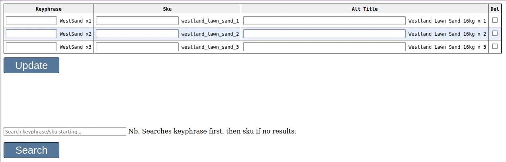
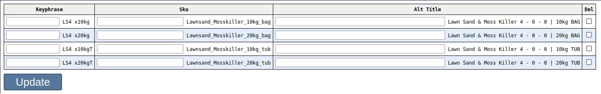

# Coding task

** ***Code should have suitable comments*** **

Create a form (PHP, HTML, CSS) to edit an SQLITE database table (schema & data below).


The search string should match the start of a keyphrase, or the start of a sku (if no keyphrase match).

Searching 'WestSand' should display the following results:



And 'Lawnsand' the following:



### Update
Entering a 'Keyphrase', 'Sku' and/or 'Alt Title' should update the existing record (assuming the Update button has been pressed). The Update button should not appear (or be enabled) unless one or more fields have been entered.

### Delete
A selected checkbox in the 'Del' column should delete the corresponding record when the Update button is pressed.

### Add
Up to six new records need to be added in a single post. As before, the 'Add' button should only display (be enabled) if one or more fields contain text.

- - -


- - -

### Database table schema / data
```sql
CREATE TABLE 'autocomplete_order' (
   'keyphrase' TEXT,
   'sku' TEXT,
   'alt_title' TEXT,
   PRIMARY KEY('sku')
)

INSERT INTO 'autocomplete_order' VALUES ('WestSand x1','westland_lawn_sand_1','Westland Lawn Sand 16kg x 1');
INSERT INTO 'autocomplete_order' VALUES ('WestSand x2','westland_lawn_sand_2','Westland Lawn Sand 16kg x 2');
INSERT INTO 'autocomplete_order' VALUES ('WestSand x3','westland_lawn_sand_3','Westland Lawn Sand 16kg x 3');
INSERT INTO 'autocomplete_order' VALUES ('LS4 x10kg','Lawnsand_Mosskiller_10kg_bag','Lawn Sand & Moss Killer 4 - 0 - 0 | 10kg BAG');
INSERT INTO 'autocomplete_order' VALUES ('LS4 x20kg','Lawnsand_Mosskiller_20kg_bag','Lawn Sand & Moss Killer 4 - 0 - 0 | 20kg BAG');
INSERT INTO 'autocomplete_order' VALUES ('LS4 x10kgT','Lawnsand_Mosskiller_10kg_tub','Lawn Sand & Moss Killer 4 - 0 - 0 | 10kg TUB');
INSERT INTO 'autocomplete_order' VALUES ('LS4 x20kgT','Lawnsand_Mosskiller_20kg_tub','Lawn Sand & Moss Killer 4 - 0 - 0 | 20kg TUB');
```
