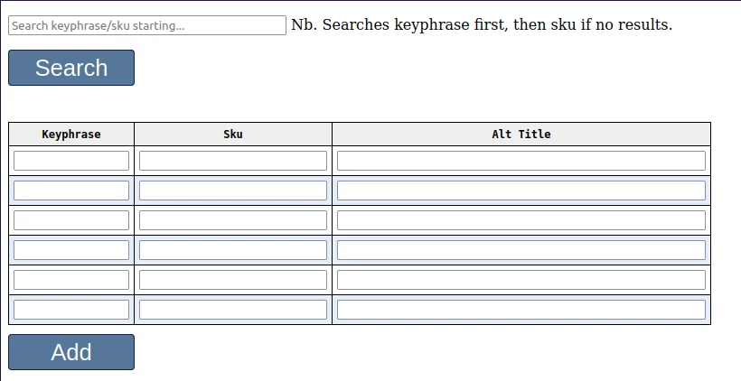
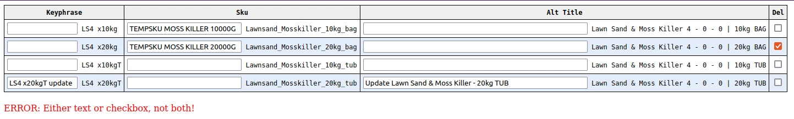
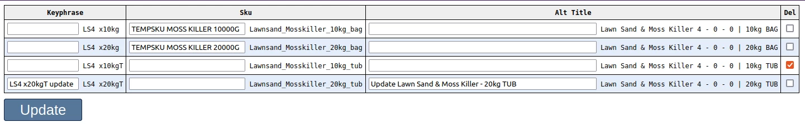
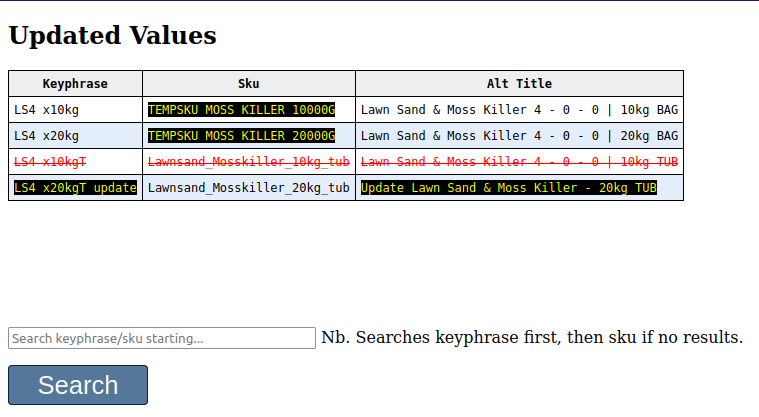
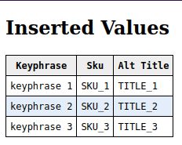
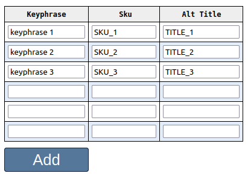

# Coding task

\* ***All code should be commented where appropriate*** *

### PART 1: Create a form (PHP, HTML, CSS) to edit an SQLite database table ([schema & data](#database-table-schema--data) below).



The search string should match the start of a keyphrase, or the start of a sku (if no keyphrase match).

A '***WestSand***' search should display the following results:


And '***Lawnsand***' the following:


### Update
Entering a 'Keyphrase', 'Sku' and/or 'Alt Title' should update the existing record (assuming the Update button has been pressed).

### Delete
A selected checkbox in the 'Del' column should delete the corresponding record when the Update button is pressed.

### Add
Up to six new records need to be added in a single post.

- - -
### PART 2: Data validation and sanitization

- Client-side form validation using JavaScript:
  - Ideally, form submit buttons should be disabled/hidden if no text has been entered.
  - Likewise, new records should have all 3 fields entered.
  - Updates to an existing record can either be updated values or deletes, not both. The example below displays an error message because the user is attempting to do both. 



- Server-side data sanitization
  - Strip leading / trailing whitespace from submitted form values.
  - Multiple whitespace should be replaced with a single space.

### PART 3: Displaying results

The following update to the 4 '***Lawnsand***' records would rename the skus of the first 2 records. Delete record 3, and rename the 'Keyphrase' and 'Alt Title' of the last record.



It would be helpful from a user experience perspective to display the outcome of the update: modified fields, deleted records. The following example is one possible solution:



Likewise, the following would be displayed:



Assuming the following had been submitted:



###  

- - -

### Database table schema / data
```sql
CREATE TABLE 'autocomplete_order' (
   'keyphrase' TEXT,
   'sku' TEXT,
   'alt_title' TEXT,
   PRIMARY KEY('sku')
)

INSERT INTO 'autocomplete_order' VALUES ('WestSand x1','westland_lawn_sand_1','Westland Lawn Sand 16kg x 1');
INSERT INTO 'autocomplete_order' VALUES ('WestSand x2','westland_lawn_sand_2','Westland Lawn Sand 16kg x 2');
INSERT INTO 'autocomplete_order' VALUES ('WestSand x3','westland_lawn_sand_3','Westland Lawn Sand 16kg x 3');
INSERT INTO 'autocomplete_order' VALUES ('LS4 x10kg','Lawnsand_Mosskiller_10kg_bag','Lawn Sand & Moss Killer 4 - 0 - 0 | 10kg BAG');
INSERT INTO 'autocomplete_order' VALUES ('LS4 x20kg','Lawnsand_Mosskiller_20kg_bag','Lawn Sand & Moss Killer 4 - 0 - 0 | 20kg BAG');
INSERT INTO 'autocomplete_order' VALUES ('LS4 x10kgT','Lawnsand_Mosskiller_10kg_tub','Lawn Sand & Moss Killer 4 - 0 - 0 | 10kg TUB');
INSERT INTO 'autocomplete_order' VALUES ('LS4 x20kgT','Lawnsand_Mosskiller_20kg_tub','Lawn Sand & Moss Killer 4 - 0 - 0 | 20kg TUB');
```
